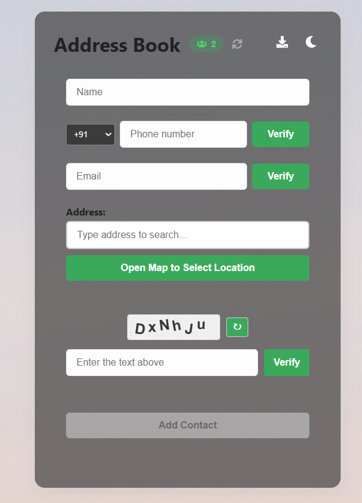
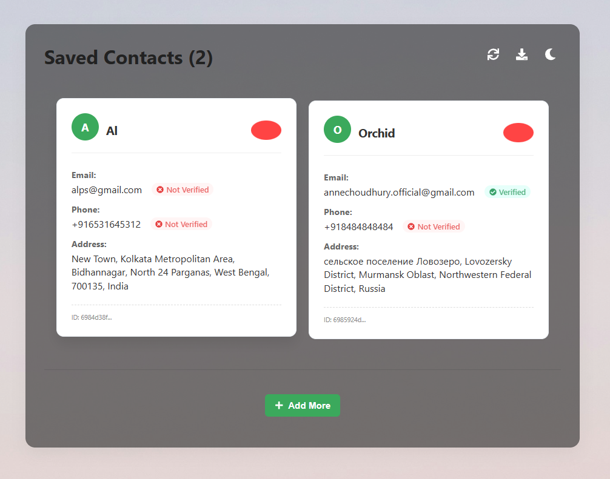
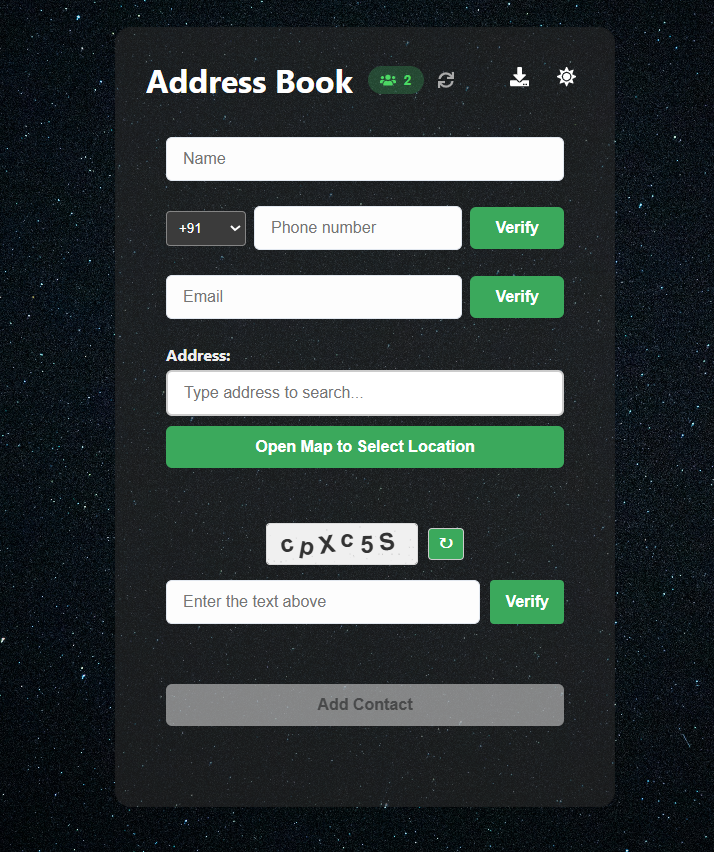
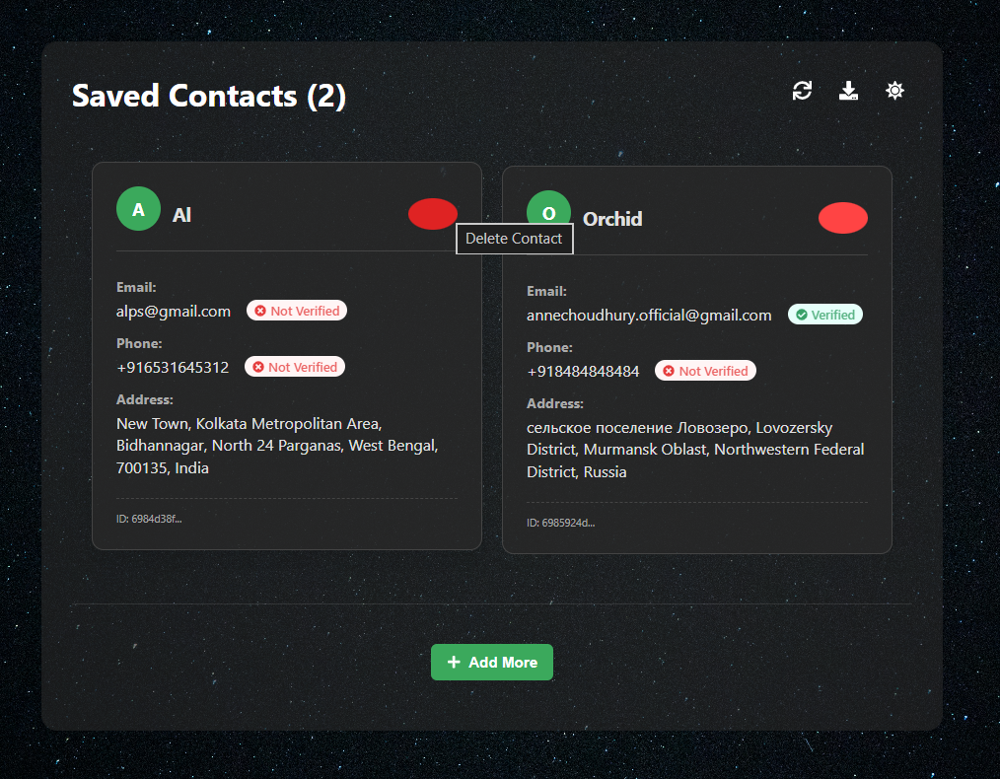

# **Address Book Manager**

A modern, full-stack address book application with contact management, email verification, and interactive maps.

## **Features**

- **Contact Management**: Add, view, and delete contacts
- **Email Verification**: OTP verification via email
- **Interactive Maps**: Select addresses using external map API
- **Dual Display Modes**: Card view and table view for contacts
- **Light/Dark Mode**: Automatic theme switching based on system preferences
- **CAPTCHA Protection**: Built-in human verification
- **Responsive Design**: Works on desktop and mobile devices

## **Tech Stack**

**Frontend:**
- React.js
- External Map API
- CSS3 with modern flexbox/grid

**Backend:**
- Node.js
- Express.js
- MongoDB
- Nodemailer 
## **Screenshots**

### **Light Mode**
| Add Contact Page | Saved Contacts Page |
|------------------|---------------------|
|  |  |

### **Dark Mode**
| Add Contact Page | Saved Contacts Page |
|------------------|---------------------|
|  |  |
